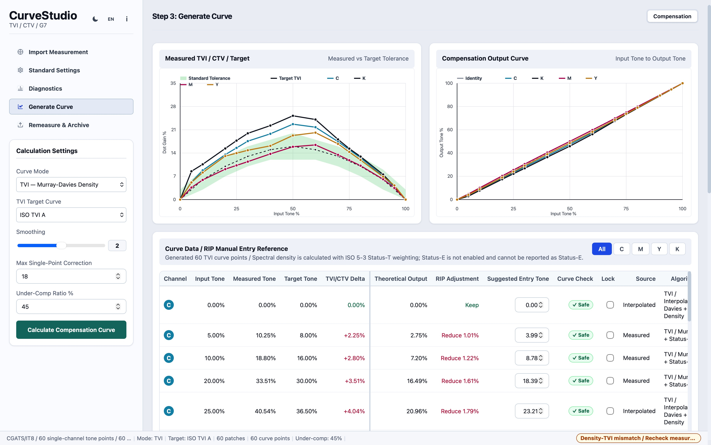
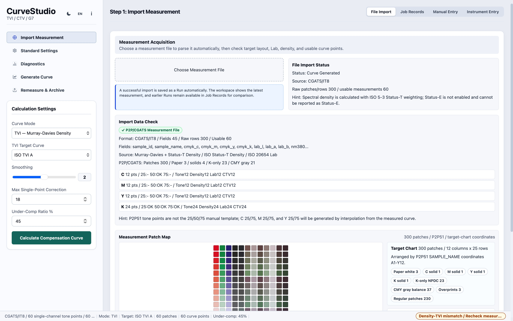
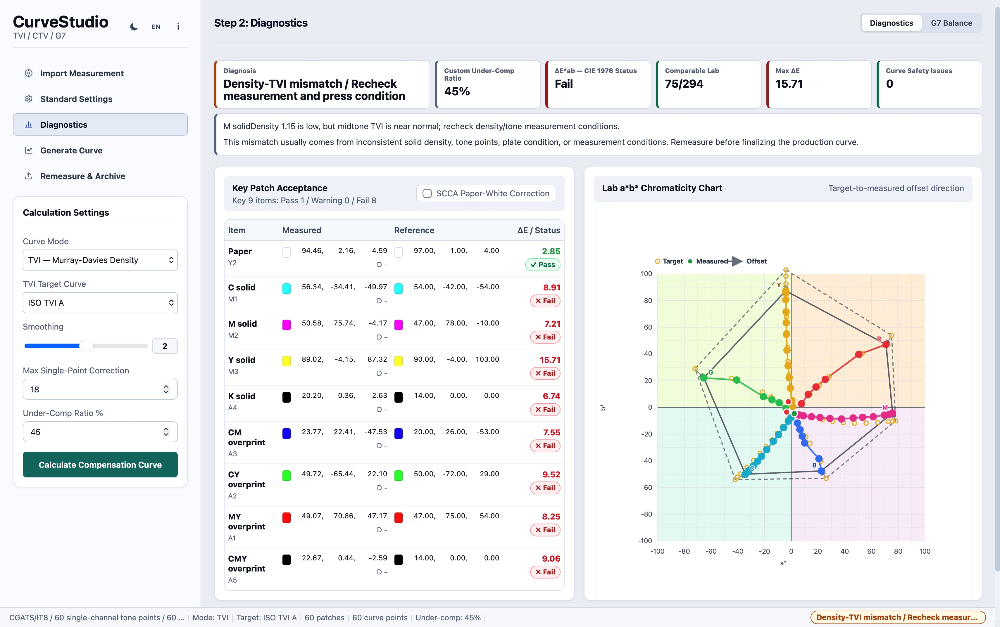

# CurveStudio

CurveStudio is a macOS tool for offset printing calibration workflows. It focuses on TVI / CTV / G7 compensation curve calculation, helping print technicians convert press measurement data into practical correction curves for RIP workflows.

The project is designed for prepress engineers, color management technicians, G7 calibration users, and small to medium-sized printing companies that need a transparent and practical calibration tool.

## Why this project exists

Commercial calibration and curve-management tools are often expensive, closed-source, or difficult to adapt to local production workflows. CurveStudio aims to provide a focused open-source alternative for print calibration tasks such as:

- Measuring and analyzing CMYK tone reproduction
- Comparing press measurement data with target TVI / CTV / G7 curves
- Calculating compensation values for production curves
- Visualizing tone curves for technical review
- Preparing data that can later be exported into RIP-compatible curve formats

CurveStudio is based on a long-standing idea from real offset printing production work. In the printing industry, curve calibration tools are usually commercial, closed-source, or tied to specific vendor workflows. CurveStudio aims to make TVI / CTV / G7 compensation curve calculation more transparent, practical, and accessible. It appears to be one of the first open-source macOS tools focused specifically on this print-calibration workflow.

## Current scope

CurveStudio is currently an MVP. The initial focus is to make the core calibration workflow clear and maintainable:

1. Import or enter CMYK measurement data
2. Compare measured tone values against target curves
3. Calculate compensation values
4. Display curve charts for review
5. Export structured data for further RIP curve preparation

## Target users

- Offset printing technicians
- Prepress departments
- Color management engineers
- G7 / TVI / CTV calibration users
- Small and medium-sized printing companies
- Developers working on open print-calibration workflows

## Planned features

- CMYK measurement table input
- TVI / CTV / G7 target comparison
- Compensation curve calculation
- CSV import and export
- Curve visualization
- Example datasets for real press calibration scenarios
- Documentation for print-calibration workflows
- Future RIP curve export format support

## Example workflow

1. Measure a CMYK control strip using a densitometer or spectrophotometer.
2. Enter or import measured tone values into CurveStudio.
3. Select the target method, such as TVI, CTV, or G7-related correction.
4. Review measured curves, target curves, and compensation curves.
5. Export the calculated correction values for RIP curve preparation.

## Screenshots

### Generate compensation curve

CurveStudio compares measured TVI / CTV data against target curves and generates compensation output values for RIP curve preparation.

### Import measurement data

The import workflow parses CGATS / IT8 measurement data, checks usable tone points, and prepares the dataset for curve calculation.

### Diagnostics and Lab chart

The diagnostics view helps review density, Lab, delta E, target-to-measured offset, and possible measurement or press-condition issues.

## Repository structure

- `docs/` — technical documentation, roadmap, and maintenance plan
- `examples/` — sample measurement datasets
- `screenshots/` — application screenshots and image guidelines
- `README.md` — project overview
- `LICENSE` — open-source license

## Documentation

- [Curve calculation notes](docs/curve-calculation.md)
- [G7 / CTV workflow notes](docs/g7-ctv-workflow.md)
- [Roadmap](docs/roadmap.md)
- [Maintenance plan](docs/maintenance-plan.md)

## Example datasets

Sample datasets are included under `examples/` to demonstrate typical CMYK press measurement inputs and compensation curve outputs.

## Maintainer

CurveStudio is maintained by [lb791203](https://github.com/lb791203).

## License

This project is released under the MIT License. See [LICENSE](LICENSE) for details.
